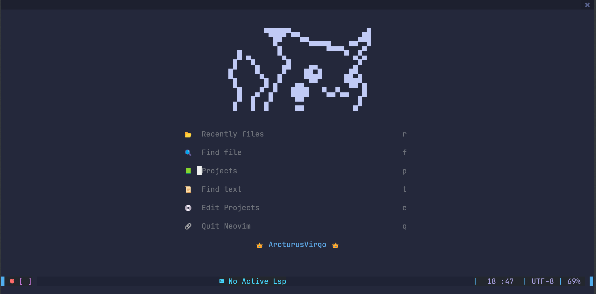
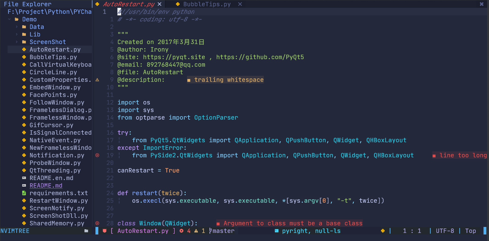

# 介绍




# 从零开始配置

## scoop安装

Scoop 默认使用普通用户权限，其本体和安装的软件默认会放在 %USERPROFILE%\scoop(即 C:\Users\用户名\scoop)，使用管理员权限进行全局安装 (-g) 的软件在 C:\ProgramData\scoop。如果有自定安装路径的需求，那么要提前设置好环境变量，否则后续再改不是一件容易的事情。

### 设置用户安装路径

```powershell
$env:SCOOP='D:\Scoop'
[Environment]::SetEnvironmentVariable('SCOOP', $env:SCOOP, 'User')
```
### 设置全局安装路径（需要管理员权限）

```powershell
$env:SCOOP_GLOBAL='D:\Scoop_Global'
[Environment]::SetEnvironmentVariable('SCOOP_GLOBAL', $env:SCOOP_GLOBAL, 'Machine')
```
### 设置允许 PowerShell 执行本地脚本

```powershell
Set-ExecutionPolicy -ExecutionPolicy RemoteSigned -Scope CurrentUser
```
### 正式安装scoop

```powershell
# 使用国内源安装
iwr -useb https://gitee.com/glsnames/scoop-installer/raw/master/bin/install.ps1 | iex
# 使用默认源安装
iwr -useb get.scoop.sh | iex
# Scoop换源
scoop config SCOOP_REPO 'https://gitee.com/glsnames/Scoop-Core'
scoop update
# 添加 nerd-fonts bucket
scoop bucket add nerd-fonts
```
## 使用scoop安装依赖软件

~~~powershell
# scoop软件安装命令
scoop install <name>
~~~

`aria2` - Scoop多线程下载软件

`JetBrainsMono-NF-Mono` - 所需字体

`neovim` - neovim本体

`nodejs` - 依赖软件

`python` - 依赖软件

`git` - 依赖软件

`fd` - 依赖软件

`ripgrep` - 依赖软件

## 配置nvim

### 基本配置

|     文件名称      |       作用       |
| :---------------: | :--------------: |
|    `basic.lua`    |     系统设置     |
| `colorscheme.lua` |     主题设置     |
|   `compile.lua`   |   一键编译运行   |
|  `fix-yank.lua`   | 与系统剪贴板互通 |
| `keybindings.lua` |    自定义按键    |

以上文件均在入口文件`init.lua`中引入

### 插件配置

#### 使用git安装插件管理器packer

~~~powershell
# 对于Windows系统（本文在Windows系统下）
git clone --depth 1 https://github.com/wbthomason/packer.nvim ~/AppData/Loacl/nvim-data/site/pack/packer/start/packer.nvim
# 对于Linux系统
git clone --depth 1 https://github.com/wbthomason/packer.nvim ~/.local/share/nvim/site/pack/packer/start/packer.nvim
~~~

在`lua`目录下创建`plugins.lua`文件来管理插件

#### 基本插件配置

在`lua`目录下创建`plugin-config`文件夹，用来存放基本插件的配置

这些配置文件均由`setup.lua`文件引用，再由`init.lua`文件引入

|        文件名称         |      作用      |
| :---------------------: | :------------: |
|      ` alpha.lua`       |     启动页     |
|    ` bufferline.lua`    |     buffer     |
|    ` Comment.lua`      |    一键注释    |
|    ` galaxyline.lua`    |     状态栏     |
| ` indent-blankline.lua` |     缩进线     |
|  ` nvim-autopairs.lua`  |    自动括号    |
|    ` nvim-tree.lua`     |     文件树     |
| ` nvim-treesitter.lua`  |    语法高亮    |
|     ` project.lua`      |      项目      |
|     ` surround.lua`     | 快速更换引号等 |
|    ` telescope.lua`     |    全局搜索    |

以上文件均在基本插件配置入口文件`setup.lua`中引入

#### LSP相关插件配置

在`lua`目录下创建`lsp`文件夹，用来存放LSP相关插件的配置

这些配置文件均由`setup.lua`文件引用，再由`init.lua`文件引入

|         文件名称         | 作用  |
| :----------------------: | :---: |
|  `cmp.lua`             | 自动补全 |
|  `lsp-status.lua`    | / |
|  `lspconfig.lua`    | 自动加载LSP |
|  `lspsaga.lua`     | 美化LSP错误提示 |
|  `mason-lspconfig.lua` | 自动下载LSP |
| `mason.lua`      | LSP服务器管理 |
|  `null-ls.lua`     | 格式化 |

以上文件均在LSP相关插件配置入口文件`setup.lua`中引入

### 配置文件结构

```
nvim
│  init.lua
│
├─lua
│  │  basic.lua
│  │  colorscheme.lua
│  │  compile.lua
│  │  fix-yank.lua
│  │  keybindings.lua
│  │  plugins.lua
│  │
│  ├─lsp
│  │      cmp.lua
│  │      lsp-status.lua
│  │      lspconfig.lua
│  │      lspsaga.lua
│  │      mason-lspconfig.lua
│  │      mason.lua
│  │      null-ls.lua
│  │      setup.lua
│  │
│  └─plugin-config
│          alpha.lua
│          bufferline.lua
│          Comment.lua
│          galaxyline.lua
│          indent-blankline.lua
│          nvim-autopairs.lua
│          nvim-tree.lua
│          nvim-treesitter.lua
│          project.lua
│          setup.lua
│          surround.lua
│          telescope.lua
│
├─pack
└─plugin
        packer_compiled.lua
```

